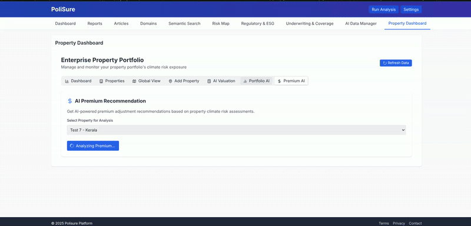
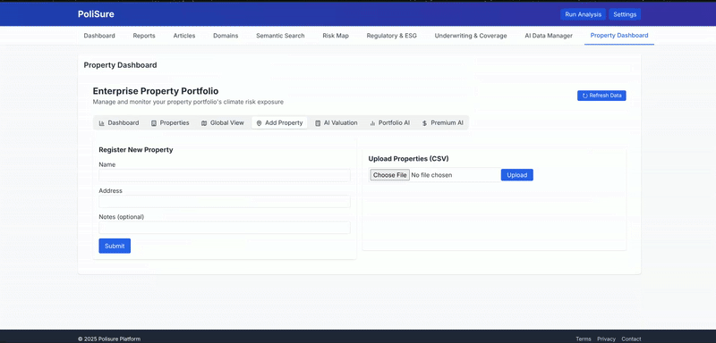
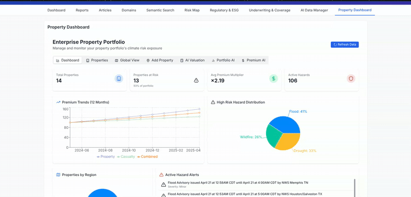

# Polisure - Smarter Underwriting for a Changing World

Polisure is a comprehensive climate risk intelligence platform built for underwriters, actuaries, and ESG teams alike. It combines regulatory tracking, real-time climate risk monitoring, property portfolio management, and AI-powered analytics to help insurers make data-driven decisions in an increasingly volatile climate landscape.


## Core Features

### Property Portfolio Management
- **Multi-Hazard Risk Analysis**: Comprehensive assessment of flood, wildfire, storm, wind, and drought risks
- **Portfolio Optimization**: AI-powered recommendations to balance and strengthen your property portfolio
- **Property Valuation**: Climate risk-adjusted property valuations with detailed factor analysis
- **Premium Optimization**: Risk-based premium calculations with coverage recommendations

### Domain Risk Tracking & Analysis
- **5-Domain Risk Scoring**: Real-time risk assessment across Property, Casualty, Life, Health, and Reinsurance domains
- **Impact Assessment**: Quantitative and qualitative assessment of climate risks on insurance business lines
- **Trend Analysis**: Visualize risk emergence and evolution across insurance domains

### Regulatory Intelligence
- **Regulatory Framework Monitoring**: Track emerging, established, and proposed regulatory frameworks
- **Compliance Readiness**: Stay ahead of regulatory changes with impact analysis for your business
- **Geographic Coverage**: Global, regional, and local regulatory tracking with relevance scoring

### AI-Powered Insights
- **Automated Report Generation**: Regular intelligence reports based on latest climate and regulatory data
- **Article Summarization**: AI-generated summaries of key articles and regulatory publications
- **LLM-Powered Analysis**: Advanced language model analysis of risk implications and strategic recommendations

## Demo

### Property Portfolio Dashboard
#### Portfolio Optimization & Premium Recommendations

#### Property Portfolio Addition & Property Valuation

#### Property Dashboard



## Technical Architecture

Polisure leverages a modern tech stack:

- **Backend**: MongoDB, FAISSm FastAPI, Langgraph and Claude AI with async processing for real-time data ingestion
- **Frontend**: React with Tailwind CSS for a responsive, data-rich interface
- **Geospatial**: Integrated climate risk APIs and interactive mapping
- **Data Sources**: Continuous scraping of climate news, regulatory publications, and hazard data

## Getting Started

### Installation

```bash
# Clone the repository
git clone https://github.com/your-org/polisure.git
cd polisure

# Backend setup
cd backend
pip install -r requirements.txt
python -m app

# Frontend setup
cd polisure
npm install
npm run dev
```

### Configuration

1. Copy `.env.example` to `.env` and fill in required API keys - Anthropic
2. Run mongodb docker image 


## Contact

For more information, support, or partnership inquiries:
- Email: gpteehee@gmail.com
- Website: [LinkedIn](https://www.linkedin.com/in/vaishnavisonawane/)

---

